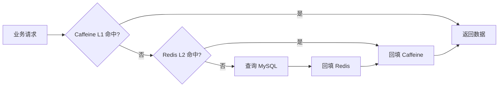

# 🎫 高并发智能演出票务与推荐平台

> 面向真实演出购票场景设计的全链路系统，覆盖演出管理、实名抢票、Kafka 异步建单、可靠出票、个性化推荐、RAG 智能找演出与后台审核。

<p align="center">
  
  
  
  
  
  
  
  
</p>

本项目的重点不是简单实现“可以买票”，而是围绕票务系统中的突发流量、库存正确性、数据库与消息队列一致性、重复消息、持续消费失败、热点缓存及智能检索，构建一套可恢复、可追踪、可补偿的工程方案。

---

## 目录

- [项目能力](#项目能力)
- [技术栈](#技术栈)
- [整体架构](#整体架构)
- [核心链路](#核心链路)
- [数据与组件职责](#数据与组件职责)
- [快速开始](#快速开始)
- [关键配置](#关键配置)
- [验证建议](#验证建议)
- [项目亮点](#项目亮点)
- [演示与联系](#演示与联系)

---

## 项目能力

- **演出业务**：演出发布与审核、场次管理、票档管理、上下架与停售控制。
- **实名购票**：观演人资格校验、一票一证限制、短期提交凭证与防重复提交。
- **高并发抢票**：Redis Lua 原子限流、短锁与 Kafka 削峰，MySQL 条件更新完成最终扣库。
- **异步建单**：请求进入 `order-create-topic`，由消费者在数据库事务中扣减库存并创建订单。
- **可靠出票**：支付事务通过 Transactional Outbox 产生出票事件，由 Debezium CDC 可靠投递到 Kafka。
- **消费幂等**：Inbox 与电子票在同一事务中提交，抵御 Kafka At-least-once 下的重复投递。
- **失败恢复**：有限重试、DLT、异常订单、失败上下文记录与人工补偿形成闭环。
- **多级缓存**：Caffeine 作为进程内 L1，Redis 作为跨实例 L2，MySQL 保持权威数据。
- **个性化推荐**：基于 MySQL 中的用户画像、浏览/购票行为、城市、类别、时间与热度进行候选过滤和重排。
- **RAG 智能找演出**：Ollama 本地模型完成内容理解、意图解析与答案生成，Qdrant 仅承担语义向量召回。
- **管理后台**：演出审核、场次票档维护、订单查询、异常订单处理与补偿入口。

---

## 技术栈

| 层次 | 技术 | 主要职责 |
|---|---|---|
| 前端 | React | 用户端、订单端、管理后台与 AI 交互 |
| 后端 | Spring Boot、MyBatis-Plus | 领域服务、事务编排、消息消费与接口实现 |
| 数据库 | MySQL | 订单、库存、Outbox、Inbox、电子票及用户画像等权威数据 |
| 本地缓存 | Caffeine | 进程内热点数据读取与快速命中 |
| 分布式缓存 | Redis、Lua | 限流、短锁、提交凭证、共享缓存与已购集合 |
| 消息系统 | Kafka、Spring Kafka | 抢票削峰、异步建单、可靠出票与失败隔离 |
| CDC | Kafka Connect、Debezium MySQL Connector | 读取 MySQL Binlog，并将 Outbox 变更写入 Kafka |
| 事件路由 | Debezium Outbox Event Router SMT | 在 Kafka Connect 内将 CDC Envelope 转换为领域事件 |
| AI 推理 | Ollama、Qwen3-VL、Qwen3-Embedding、Qwen3 LLM | 内容理解、向量化、意图解析与答案生成 |
| 向量检索 | Qdrant | 演出语义索引与 Top-K 候选召回 |

---

## 整体架构


系统按职责划分为演出域、订单域、出票域、推荐域、AI 域和管理后台。核心设计原则如下：

1. **入口控制突发流量**：Redis Lua 在进入核心交易链路前完成原子校验与限流。
2. **MySQL 决定最终交易结果**：库存、订单、票档与电子票均以数据库事务结果为准。
3. **异步链路必须可恢复**：消息允许重投，但业务处理必须幂等；持续失败必须隔离并可补偿。
4. **缓存不承担权威状态**：Caffeine 与 Redis 用于加速，失效或不一致时最终回到 MySQL 校验。
5. **推荐与 RAG 解耦**：普通推荐使用 MySQL 用户画像；Qdrant 只服务于 AI 语义检索。

---

## 核心链路

### 1. 高并发抢票与异步建单


```text
用户
  → /pre-check
  → Redis Lua 令牌桶
  → submitToken
  → 一票一证短锁
  → /create
  → order-create-topic
  → OrderCreateConsumer
  → MySQL 条件更新扣库存
  → 创建订单与观演人关系
```

关键点：

- Redis Lua 将“校验 + 扣令牌”合并为原子操作，避免并发检查与修改之间出现竞态。
- `submitToken` 使用短期凭证控制重复请求和绕过预检的直接建单。
- Redis 短锁降低同一身份证、同一票档的重复并发请求；数据库唯一约束负责最终兜底。
- Kafka 将瞬时请求峰值转换为可控消费速率，减少数据库被突发流量直接击穿的风险。
- 真正的库存扣减仍由 MySQL 条件更新完成，库存不足时更新失败，从根源上避免超卖。

### 2. 支付与 Transactional Outbox


支付方法不直接执行 `update order + kafkaTemplate.send()`，而是在同一个 MySQL 本地事务中：

```text
UPDATE tb_order: status 1 → 6
+
INSERT tb_outbox_event: TICKET_ISSUE_REQUESTED
→ COMMIT
```

事务提交后，出票事件依次经过：

```text
MySQL Binlog
→ Debezium MySQL Connector
→ Kafka Connect
→ Outbox Event Router SMT
→ order-ticket-issue-topic
→ TicketIssueConsumer
```

这样订单支付状态和出票事件只会一起提交或一起回滚，消除了“数据库成功、Kafka 发送失败”的双写窗口。

> **注意**：Outbox Event Router 不在 Spring Boot 内。它是 Debezium 提供的 Kafka Connect SMT，运行于 Kafka Connect 进程中。

Outbox 表遵循 append-only 原则：

- 新领域事件使用 `INSERT`。
- 历史数据可以通过 `DELETE` 清理。
- 不通过 `UPDATE status = SENT` 记录发送进度；进度由 Binlog 位点和 Kafka Connect offset 管理。

### 3. Inbox 幂等、有限重试与人工补偿


Kafka 的 At-least-once 语义允许同一事件被重复投递，因此消费端将幂等判断纳入业务事务：

```text
TicketIssueConsumer
  → INSERT tb_inbox_event
  → INSERT tb_order_ticket
  → 同一事务 COMMIT
  → Redis SADD purchasedSet
```

- `eventId` 已存在时跳过重复出票，唯一约束抵御并发重复消费。
- Inbox 与电子票同事务提交，出票中途异常时二者一起回滚，不会出现“Inbox 已记录但电子票未生成”。
- Redis 更新放在数据库提交后执行；若 Redis 暂时失败，则抛出异常触发消息重投。
- 重投时 Inbox 阻止重复出票，但会再次执行幂等的 Redis `SADD`，从而修复已购集合。

持续失败的毒消息不会无限阻塞主消费链路：

```text
DefaultErrorHandler
  → 固定间隔有限重试
  → DeadLetterPublishingRecoverer
  → order-ticket-issue-topic.DLT
  → TicketIssueDltConsumer
  → 记录失败上下文
  → order.status 6 → 5
  → 管理员修复并人工补偿
```

人工补偿仍复用 Inbox 与数据库唯一约束，防止补偿操作产生第二份电子票。

### 4. Caffeine + Redis 多级缓存



- **Caffeine L1**：进程内热点读取，延迟低，但实例之间不共享。
- **Redis L2**：多实例共享缓存，并承担限流、短锁和已购集合等分布式能力。
- **MySQL**：最终权威数据源；写路径采用“先更新数据库，再失效缓存”。
- **缓存穿透**：参数校验与空值短缓存。
- **缓存击穿**：热点 Key 互斥重建或逻辑过期。
- **缓存雪崩**：TTL 抖动、分批预热，避免大量 Key 同时失效。

### 5. 个性化推荐

普通推荐链路不依赖 Qdrant。用户画像和浏览/购票行为持久化在 MySQL 中，并参与候选生成、业务过滤与打分重排。

```text
用户画像 + 浏览/购票行为 + 城市/类别偏好
  → 可售演出候选集
  → 时间、城市、状态等业务过滤
  → 偏好、热度与规则综合打分
  → 首页“为您推荐”
```

这种设计避免把“语义相似”误当成完整推荐逻辑，也便于追踪推荐依据。

### 6. Ollama + Qdrant RAG 智能找演出


索引构建链路：

```text
创建 / 审核演出
  → Qwen3-VL 理解海报与素材
  → 提取 style / city / eventType / tags / summary
  → Qwen3-Embedding
  → 4096 维向量
  → Qdrant
```

用户查询链路：

```text
自然语言问题
  → Qwen3 LLM 意图解析
  → Qwen3-Embedding 查询向量
  → Qdrant Top-K 召回 eventIds
  → MySQL 过滤上下架、时间、价格、场次与库存
  → MySQL 用户画像 + 行为数据 + 业务规则重排
  → Qwen3 LLM 生成答案
  → 返回演出卡片与推荐理由
```

职责边界：

- **Qdrant** 负责“找得像”，不保存或决定权威库存和交易状态。
- **MySQL 与业务规则** 负责“当前能不能买”以及“是否符合用户偏好”。
- **LLM** 负责解析问题和组织推荐理由，不直接修改订单、库存或演出状态。

---

## 数据与组件职责

### 关键数据表

| 数据表 | 作用 |
|---|---|
| `tb_order` | 订单主表与状态流转 |
| `tb_outbox_event` | 与业务事务一起写入的领域事件 |
| `tb_inbox_event` | 消费端事件去重记录 |
| `tb_order_ticket` | 订单对应的电子票 |
| `tb_ticket_issue_failure` | DLT 消费后的失败上下文与补偿依据 |
| 用户画像/行为相关表 | 保存偏好、浏览、收藏和购票等推荐特征 |

### 订单状态语义

| 状态 | 含义 |
|---|---|
| `1` | 待支付 |
| `6` | 已支付，出票处理中 / 未检票 |
| `5` | 出票持续失败，进入异常订单处理 |

### Kafka Topic

| Topic | Producer | Consumer | 用途 |
|---|---|---|---|
| `order-create-topic` | 抢票创建接口 | `OrderCreateConsumer` | 削峰并异步创建订单 |
| `order-ticket-issue-topic` | Debezium Outbox Event Router | `TicketIssueConsumer` | 支付成功后的可靠出票 |
| `order-ticket-issue-topic.DLT` | `DeadLetterPublishingRecoverer` | `TicketIssueDltConsumer` | 隔离持续失败的出票消息 |

---

## 快速开始

### 1. 环境要求

请以仓库中的 `pom.xml`、`package.json` 和基础设施配置为准准备以下环境：

- JDK 与 Maven
- Node.js 与 npm
- MySQL，并开启 ROW 模式 Binlog
- Redis
- Kafka 与 Kafka Connect
- Debezium MySQL Connector 插件
- Qdrant
- Ollama 及项目使用的 Qwen3-VL、Qwen3-Embedding、Qwen3 LLM 模型

### 2. 克隆项目

```bash
git clone <your-repository-url>
cd <your-project-directory>
```

### 3. 初始化数据库

创建业务数据库，并执行仓库中的表结构与初始化数据脚本：

```bash
mysql -u <username> -p <database> < path/to/schema.sql
```

确保 MySQL 已开启 Binlog：

```ini
[mysqld]
server-id=1
log-bin=mysql-bin
binlog-format=ROW
binlog-row-image=FULL
```

修改配置后重启 MySQL，并为 Debezium 使用的数据库账号授予读取 Binlog 所需权限。

### 4. 启动基础设施

建议顺序：

```text
MySQL / Redis
→ Kafka
→ Kafka Connect + Debezium Connector
→ Qdrant
→ Ollama
→ Spring Boot
→ React
```

启动 Kafka Connect 后，应确认：

- Debezium MySQL Connector 状态为 `RUNNING`。
- `plugin.path` 中已加载 Debezium Connector。
- Connector 只捕获目标业务库和 `tb_outbox_event`。
- Outbox Event Router 已启用且能够按 `topic` 字段路由。

### 5. 启动后端

在包含 `pom.xml` 的目录执行：

```bash
mvn spring-boot:run
```

### 6. 启动前端

在包含 `package.json` 的前端目录执行：

```bash
npm install
npm run dev
```

---

## 关键配置

### 环境变量示例

不要将真实密码、密钥、服务器地址或个人信息提交到公开仓库。可以在本地配置以下环境变量，并提供脱敏后的 `.env.example`：

```dotenv
DB_URL=jdbc:mysql://localhost:3306/<database>?useUnicode=true&characterEncoding=utf8&serverTimezone=Asia/Shanghai
DB_USERNAME=<username>
DB_PASSWORD=<password>

REDIS_HOST=127.0.0.1
REDIS_PORT=6379
REDIS_PASSWORD=

KAFKA_BOOTSTRAP_SERVERS=127.0.0.1:9092
KAFKA_ORDER_CREATE_TOPIC=order-create-topic
KAFKA_TICKET_ISSUE_TOPIC=order-ticket-issue-topic

QDRANT_URL=http://127.0.0.1:6333
OLLAMA_BASE_URL=http://127.0.0.1:11434
```

### Outbox Event Router 核心配置

以下配置展示字段映射关系；数据库连接、表过滤与 Server ID 等参数请根据本地环境补充：

```json
{
  "transforms": "outbox",
  "transforms.outbox.type": "io.debezium.transforms.outbox.EventRouter",
  "transforms.outbox.table.field.event.id": "id",
  "transforms.outbox.table.field.event.key": "aggregate_id",
  "transforms.outbox.table.field.event.payload": "payload",
  "transforms.outbox.route.by.field": "topic",
  "transforms.outbox.route.topic.replacement": "${routedByValue}",
  "transforms.outbox.table.expand.json.payload": "true",
  "transforms.outbox.table.fields.additional.placement": "event_type:header:type"
}
```

转换后的业务消息约定：

```text
Kafka Topic  ← tb_outbox_event.topic
Kafka Key    ← aggregate_id
Header id    ← Outbox event id
Header type  ← event_type
Kafka Value  ← payload
```

业务消费者只处理领域消息，不解析 Debezium 的 `before / after / op` CDC Envelope。

---

## 验证建议

项目公开前建议至少完成以下可复现验证，并将脚本和结果放入 `docs/benchmark/`：

1. **并发扣库存**：库存为 N 时并发提交超过 N 个请求，确认成功订单不超过 N 且库存不小于 0。
2. **一票一证**：同一观演人重复抢同一演出，确认数据库唯一约束能够最终兜底。
3. **消息重复投递**：重复发送同一个 Outbox `eventId`，确认只生成一份电子票。
4. **出票事务回滚**：在生成电子票中途制造异常，确认 Inbox 与电子票同时回滚。
5. **Redis 故障恢复**：数据库出票成功后模拟 Redis 写入失败，恢复后确认重投只修复集合、不重复出票。
6. **毒消息隔离**：持续制造不可恢复异常，确认消息按配置重试后进入 DLT，订单变为异常状态。
7. **缓存一致性**：更新演出后确认 L1/L2 失效，后续读取能够回源并正确回填。
8. **RAG 权威过滤**：向量召回已下架或已过期演出时，确认最终回答不会返回不可购买结果。

> README 不预设或虚构 QPS、P95、P99、缓存命中率等指标。完成真实压测后，再补充测试环境、数据规模、脚本、结果与瓶颈分析。

---

## 项目亮点

- 使用 **Redis Lua + Kafka** 控制抢票峰值，并以 **MySQL 条件更新**保证库存正确性。
- 使用 **Transactional Outbox + Debezium** 消除支付事务与 Kafka 发送之间的双写窗口。
- 使用 **Inbox + 唯一约束**处理重复投递，实现可验证的消费幂等。
- 构建 **有限重试 + DLT + 异常订单 + 人工补偿**闭环，使出票失败可观测、可恢复。
- 使用 **Caffeine + Redis + MySQL** 形成多级缓存，兼顾热点性能与权威数据一致性。
- 个性化推荐基于 **MySQL 用户画像与行为数据**，不将 Qdrant 错用为普通推荐数据源。
- 使用 **Ollama + Qwen3-VL + Qwen3-Embedding + Qdrant** 实现本地化语义检索和 RAG 智能找演出。
- 将向量召回、业务过滤、个性化重排和答案生成分层，避免大模型直接决定库存与交易事实。

---

## 公开仓库安全检查

提交代码前请确认仓库中不包含：

- MySQL、Redis、Kafka、Qdrant 的真实账号与密码
- JWT Secret、短信或邮件服务密钥
- 云服务 AccessKey / SecretKey
- 真实服务器 IP、域名后台地址与证书私钥
- 用户手机号、身份证号、订单信息和测试数据中的个人隐私
- Ollama 模型本地绝对路径及内部网络地址

建议提交脱敏后的 `.env.example`、`application-example.yml` 和 Connector 示例配置，并将真实配置加入 `.gitignore`。

---

## 演示与联系

- 在线演示：`待补充`
- 演示视频：`待补充`
- 项目作品集：`待补充`
- 作者：`待补充`
- 联系方式：`待补充`

如果这个项目对你有帮助，欢迎提交 Issue 或 Star。

